## 机器学习大作业设计报告

###  使用numpy构建一个真正的CNN


### **一、项目内容**

通过python中的numpy库构建一个CNN网络，在MNIST数据集下，实现手写数字识别，并对比现在主流的深度学习框架Pytorch实现，一次来验证自行编写的模型性能。

 

### **二、CNN介绍**

在CNN出现之前，图像对于人工智能来说是一个难题，有2个原因：1、图像需要处理的数据量太大，导致成本很高，效率很低；2、图像在数字化的过程中很难保留原有的特征，导致图像处理的准确率不高。而CNN便是为了解决这些问题二存在的，其能够**有效的将大数据量的图片降维成小数据量**，并且能够**有效的保留图片特征**，符合图片处理的原则。

本项目将从最原始的写法入手，以numpy实现一个简单的CNN网络，并在MINST数据集下实现手写数字的识别，并且将对比现在主流的深度学习框架Pytorch，验证基础算法的性能。

 

### **三、CNN网络构建**

典型的CNN网络由三个部分构成：卷积层、池化层、全连接层，其中卷积层负责提取图像中的局部特征；池化层用来大幅降低参数量级(降维)；全连接层类似传统神经网络的部分，用来输出想要的结果。下面我将分为三个部分来分别介绍我的模型架构，所有的组件均以class构建。

#### **①** **卷积层**

卷积层主要用于提取图像特征，使用一个3x3的卷积核与输入图像卷积实现，具体算法流程如下：

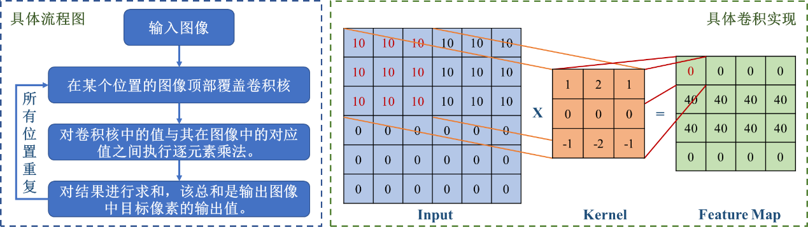

实现代码如下：

```python
Class Myconv3x3:
    def iterate_regions(self, image):
         h, w = image.shape
         for i in range(h - 2):
           for j in range(w - 2):
             im_region = image[i:(i + 3), j:(j + 3)]
             yield im_region, i, j
       def forward(self, input):
         h, w = input.shape
         output = np.zeros((h - 2, w - 2, self.num_filters))
         for im_region, i, j in self.iterate_regions(input):
           output[i, j] = np.sum(im_region*self.filters, axis=(1, 2))
         return output
```

为了实现神经网络的训练，卷积模块中需要包含前向阶段和反向阶段。在前向阶段，每一层都将缓存后向阶段所需的任何数据（如输入、中间值等）。这意味着任何后向阶段必须在相应的前向阶段之前。在后向阶段，每一层都会收到一个梯度并返回一个梯度。它将收到关于其输出的损失梯度，并返回相对于其输入的损失梯度。

前向阶段缓存通过`self.last_input = input` 实现。

而在反向阶段，我通过迭代每个图像区域/卷积核并逐步构建损失梯度来应用损失梯度方程：

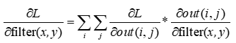

采用learning rate控制迭代速率，最终实现为：

```python
def backprop(self, d_L_d_out, learn_rate):
   d_L_d_filters = np.zeros(self.filters.shape)
   for im_region, i, j in self.iterate_regions(self.last_input):
     for f in range(self.num_filters):
       d_L_d_filters[f] += d_L_d_out[i, j, f] * im_region
   self.filters -= learn_rate * d_L_d_filters
   return None
```

 

#### **②** **池化层**

池化层主要用来大幅降低参数量级(降维)，池化将输入的宽度和高度除以池大小，见图2，对于MNIST数据集，我们将在初始卷积层之后放置一个池大小为2的Max Pooling层。池化层会将 26x26x8 的输入转换为 13x13x8 的输出。

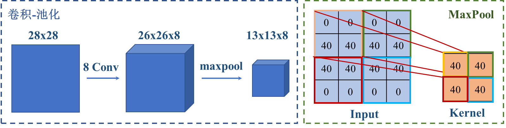

最终我同样以类的形式实现：

```python
class MyMaxPool2:
   def iterate_regions(self, image):
     h, w, _ = image.shape
     new_h = h // 2
     new_w = w // 2
     for i in range(new_h):
       for j in range(new_w):
         im_region = image[(i*2):(i*2+2), (j*2):(j*2 + 2)]
         yield im_region, i, j
   def forward(self, input):
     h, w, num_filters = input.shape
     output = np.zeros((h // 2, w // 2, num_filters))
     for im_region, i, j in self.iterate_regions(input):
       output[i, j] = np.amax(im_region, axis=(0, 1))
     return output
```

对于maxpool模块，其虽然没有权重，但是还是需要加入反向传播模块来计算梯度。在前向阶段，我加入`self.last_input = input` 来缓存输入。在反向传播中，我们将每个梯度值分配给其对应的 2x2 块中原始最大值所在的位置，将损失梯度的宽度和高度加倍，每个梯度值都分配给原始最大值所在的位置，并且每个其他值都为零。
具体实现代码如下：

```python
def backprop(self, d_L_d_out):
   d_L_d_input = np.zeros(self.last_input.shape)
   for im_region, i, j in self.iterate_regions(self.last_input):
     h, w, f = im_region.shape
     amax = np.amax(im_region, axis=(0, 1))
     for i2 in range(h):
       for j2 in range(w):
         for f2 in range(f):
           if im_region[i2, j2, f2] == amax[f2]:
             d_L_d_input[i * 2 + i2, j * 2 + j2, f2] = d_L_d_out[i, j, f2]
   return d_L_d_input
```

 

### **③** **全连接层**

我们通过使用标准最终层来解决多类分类问题：Softmax层，一个使用Softmax 函数作为其激活的全连接层，来完成CNN。使用一个有10 个节点的 softmax 层，一个代表每个数字，作为 CNN 的最后一层。层中的每个节点都将连接到每个输入。应用softmax变换后，概率最高的节点所代表的数字将是CNN的输出，如图3所示。

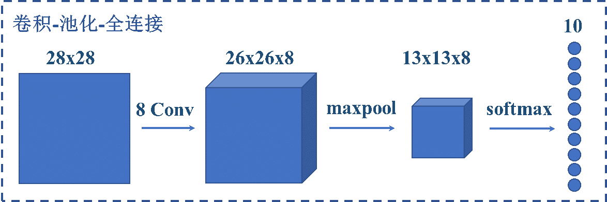

最终我同样以类的形式实现：

```python
class MySoftmax:
   def __init__(self, input_len, nodes):
     self.weights = np.random.randn(input_len,nodes)/ input_len
     self.biases = np.zeros(nodes)
   def forward(self, input):
     input = input.flatten()
     input_len, nodes = self.weights.shape
     totals = np.dot(input, self.weights) + self.biases
     exp = np.exp(totals)
     return exp / np.sum(exp, axis=0)
```

同样的，Softmax也需要反向传播。首先我在其forward模块中实现了前向缓存，通过`self.last_input_shape = input.shape，self.last_input = input，self.last_totals = totals` 实现，缓存三个对于实现反向传播有用的元素，即输入展平前的input形状，在展平后的input形状以及传递给softmax的激活值。
接下来计算输出out的梯度，因为输出是经过softmax函数，所以我们有：

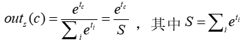

进一步计算out对于类别k=c、k≠c的情况的梯度，有：

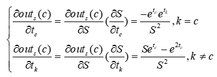

接下来便可利用该结论来计算权重梯度，偏差梯度以及输入梯度，相应的方程如下：

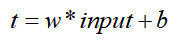

则我们可以用链式法则得到相关的梯度为：

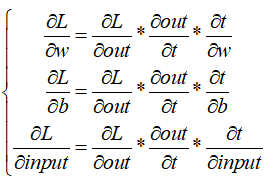

最终通过代码实现如下：

```python
def backprop(self, d_L_d_out, learn_rate):
   for i, gradient in enumerate(d_L_d_out):
     if gradient == 0:
       continue
     t_exp = np.exp(self.last_totals)
     S = np.sum(t_exp)
     d_out_d_t = -t_exp[i] * t_exp / (S ** 2)
     d_out_d_t[i] = t_exp[i] * (S - t_exp[i]) / (S ** 2)
     d_t_d_w = self.last_input
     d_t_d_b = 1
     d_t_d_inputs = self.weights
     d_L_d_t = gradient * d_out_d_t
     d_L_d_w = d_t_d_w[np.newaxis].T @ d_L_d_t[np.newaxis]
     d_L_d_b = d_L_d_t * d_t_d_b
     d_L_d_inputs = d_t_d_inputs @ d_L_d_t
     self.weights -= learn_rate * d_L_d_w
     self.biases -= learn_rate * d_L_d_b
     return d_L_d_inputs.reshape(self.last_input_shape)
```

 

#### ④ 训练过程

最终我将以上三个模块进行组合，构建了Mymodel类，实现CNN实例，在初始化中，对卷积类，池化类，全连接类进行实例化：

```python
def __init__(self, num_filters, input_len, nodes):
   self.conv = MyConv3x3(num_filters) # 28x28x1 -> 26x26x8
   self.pool = MyMaxPool2() # 26x26x8 -> 13x13x8
   self.softmax = MySoftmax(input_len, nodes) # 13x13x8 -> 10
```

在前向模块计算输出的交叉熵损失以及返回正确率：

```python
def forward(self, image, label):
   out = self.conv.forward((image / 255) - 0.5)
   out = self.pool.forward(out)
   out = self.softmax.forward(out)
   loss = -np.log(out[label])
   acc = 1 if np.argmax(out) == label else 0
   return out, loss, acc
```

最后，针对前向通道返回值进行梯度的反向传播，实现训练过程：

```python
def train(self, image, label, lr=.005):
   out, loss, acc = self.forward(image, label)
   gradient = np.zeros(10)
   gradient[label] = -1 / out[label]
   gradient = self.softmax.backprop(gradient, lr)
   gradient = self.pool.backprop(gradient)
   gradient = self.conv.backprop(gradient, lr)
   return loss, acc
```

 

**四、结果展示**

在mian.py中导入MNIST数据集，划分成训练集和测试集，并将MyModel实例化：

```python
train_images = mnist.train_images()
 train_labels = mnist.train_labels()
 test_images = mnist.test_images()
 test_labels = mnist.test_labels()
 model = MyModel(8, 13 * 13 * 8, 10)
```

读取训练图片，并进行3个epoch的训练：

```python
for epoch in range(3):
   print(**'--- Epoch %d ---'** % (epoch + 1))
   permutation = np.random.permutation(len(train_images))
   train_images = train_images[permutation]
   train_labels = train_labels[permutation]
   loss = 0
   num_correct = 0
   for i, (im, label) in enumerate(zip(train_images, train_labels)):
     if i > 0 and i % 100 == 99:
       print(**'[Step %d] Past 100 steps: Average Loss %.3f | Accuracy: %d%%'** % (i + 1, loss / 100, num_correct))
       loss = 0
       num_correct = 0
     l, acc = model.train(im, label)
     loss += l
     num_correct += acc
```

设置随机种子进行5次重复实验，训练结果如下：

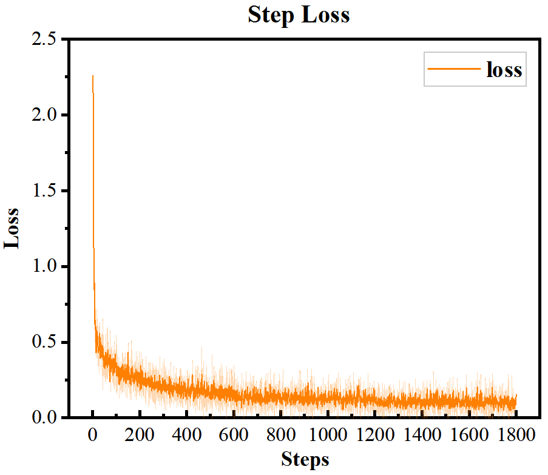 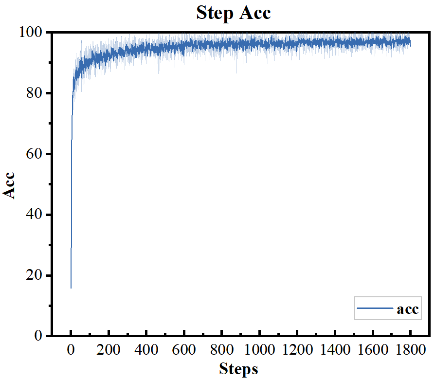

在测试集上验证准确度：

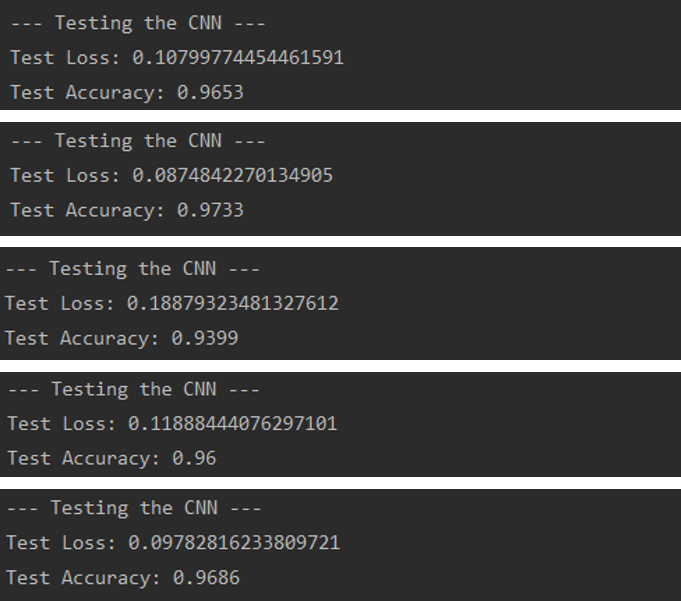


 

### **五、与Pytorch的性能比较**

  采用现在主流的深度学习框架Pytorch实现识别，并与自己搭建的CNN训练结果进行比较。

采用相同的网络结构：

```python
self.conv1 = nn.Conv2d(in_channels=1, out_channels=8, kernel_size=3, padding=0, stride=1)
self.maxpool = nn.MaxPool2d(kernel_size =2, stride=None, padding=0)
self.fc1 = nn.Linear(13 * 13 * 8, 512)
self.fc2 = nn.Linear(512, 10)
```

在3个epoch下测试结果：

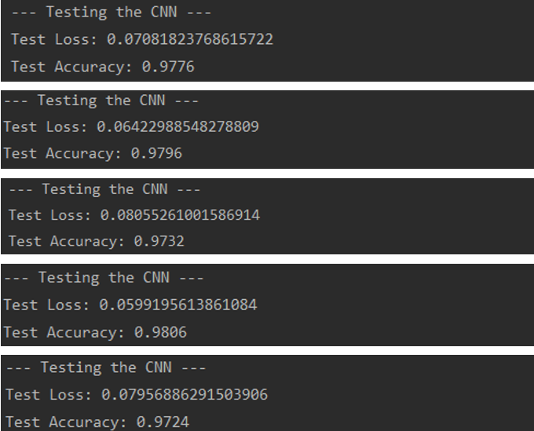

相比与用numpy实现的CNN，其具有较高的稳定性，以及训练速度，因为PyTorch将输入转为张量形式，转入GPU中训练，同时用了SGD优化器，加快loss收敛速度。

 

### **六、项目心得体会**

在本项目中，我通过numpy实现了一个CNN网络，包括其中的卷积层，池化层以及全连接层，通过公式推导、代码编写，加深了我对于卷积、池化、反向传播等概念的理解。

 

### **七、未来展望**

  后续项目中可以采用优化器来进一步提升算法性能，也需要像Pytorch类似将运算转移到GPU上，提高训练速度。

 感谢https://victorzhou.com/blog/intro-to-cnns-part-1/ 的博客支持